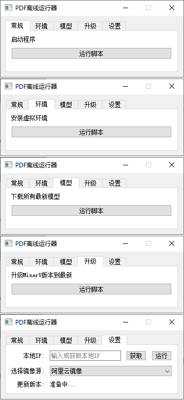

### 介绍
基于官方 mineru 解析pdf转markdown，开发了一个便于升级的便携式桌面客户端

### 具体使用：
1.支持包含数学公式的 PDF 转换为 可以复制黏贴的汉字
2.支持包含文本的 PDF 转换为 可以复制黏贴的汉字
3.支持包含图片的 PDF 转换为 可以复制黏贴的汉字
4.支持包含表格的 PDF 转换为 可以复制黏贴的汉字
5.支持 GPU 转换, 使用全新版本，选择模型下载，功能页面（服务：vlm-transformers）

### 功能视图：  

#### 常规
启动程序入口

#### 环境
下载虚拟环境mineru相关依赖包并升级，如果想要更新pip版本的话，我后面可以加一个升级pip的功能 

#### 模型
下载CPU、GPU使用的模块、依赖及大模型文件

#### 升级
升级 mineru 版本到最新

#### 设置
1.输入电脑IP或者点击获取按钮，运行成功后复制控制台地址给他人，同时手机也可以访问使用（需在同一个局域网内）
2.使用合适的镜像源下载依赖
3.更新PDF离线运行器至最新版本
